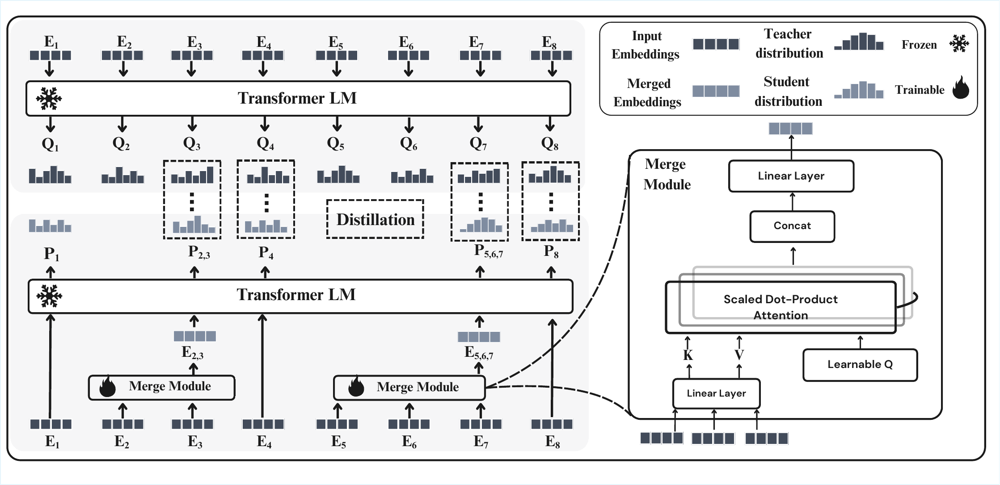
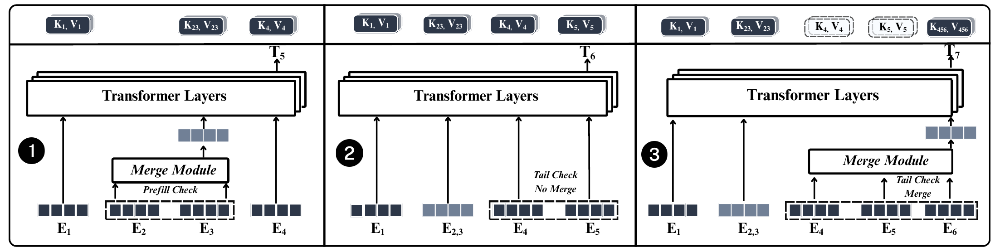

# UMIM: Distilling Sequential Computation in Transformer Language Models

<p align="center">
  <strong>Zixuan Lan<sup>1</sup> · Jessica Yang<sup>2</sup> · Yanhong Li<sup>3</sup> · Karen Livescu<sup>2</sup> · Jiawei Zhou<sup>4</sup></strong>
</p>

<p align="center">
  <sup>1</sup>The University of Chicago &nbsp;&nbsp;
  <sup>2</sup>Toyota Technological Institute at Chicago &nbsp;&nbsp;
  <sup>3</sup>Independent Researcher &nbsp;&nbsp;
  <sup>4</sup>Stony Brook University
</p>

<p align="center">
  <a href="https://zesearch.github.io/Umim-LLM/">
    
  </a>
  <a href="https://arxiv.org/abs/2609.27233">
    
  </a>
  <a href="https://neurips.cc/Conferences/2026">
    
  </a>
  <a href="https://github.com/Zesearch/Umim-LLM">
    
  </a>
  <a href="https://huggingface.co/Zesearch/UMIM">
    
  </a>
</p>

## Abstract

Transformer language models process sequences token by token in an
autoregressive manner, making growing contexts increasingly expensive. Yet many
adjacent token spans are highly predictable or frequently occur as stable units,
suggesting that their representations may be compressible. We introduce a method
for distilling sequential computation by replacing spans of input tokens with
collapsed representations, computed on the fly by a lightweight merge module.
This module generates a single surrogate embedding from a sequence of static
token embeddings that captures the functional role of the multiple tokens,
allowing pretrained models to operate on compressed inputs without architectural
changes or retraining. We apply this approach during inference to compress both
prompts and intermediate decoding steps, using a rollback mechanism to substitute
stored multi-token KV-cache entries with their single-step surrogates.
Experiments across diverse models show that the merge module can reduce effective
sequence length by up to 40% with minimal accuracy degradation across language
modeling evaluations and downstream tasks, including question answering,
summarization, commonsense reasoning, and long-form mathematical reasoning.
Additional lightweight adaptation of the merge module further improves the
accuracy-compression trade-off in selected settings. These results demonstrate
that sequential token computation in Transformers can be effectively approximated
through condensed surrogate representations that preserve the original behavior
without model updating.

## Overview

**Universal Multi-step Input Merging (UMIM)** replaces selected contiguous token
spans with single surrogate embeddings before Transformer computation. The
tokenizer, vocabulary, architecture, and pretrained backbone remain unchanged.

UMIM has four main components:

1. **Frequency-based merge rules.** We mine frequent 2-, 3-, and 4-gram token
   spans from a general corpus such as WikiText-103.
2. **A lightweight merge module.** A single-layer multi-head attention pooling
   network maps the static embeddings of a matched span to one surrogate
   embedding.
3. **Token-step-aligned distillation.** A frozen teacher LLM supplies the
   predictive behavior to preserve; only the merge module is trained.
4. **Runtime merging.** UMIM compresses the prompt before prefill and dynamically
   merges newly completed suffix spans during autoregressive decoding.

The base module is task-agnostic: the same WikiText-trained merge module and
rules can be applied directly to unseen downstream tasks. For stronger
task-specific compression, only the rules and lightweight merge module are
adapted; the backbone LLM remains frozen.

## Training the Merge Module

<p align="center">
  <a href="assets/figures/train.pdf">
    
  </a>
</p>

<p align="center">
  <a href="assets/figures/train.pdf">Open the full-resolution training figure</a>
</p>

Given a matched span with static token embeddings
`e(x[t:t+n])`, the merge module `M_phi` produces one surrogate embedding. Its
learnable queries attend over the projected span embeddings, concatenate the
per-head pooled outputs, and project them back into the backbone embedding space.

Training compares two forward passes through the **same frozen LLM**:

- the teacher processes the original, unmerged sequence;
- the student replaces every eligible span with the output of `M_phi`;
- KL divergence aligns the student distribution with the teacher distribution at
  the retained token positions;
- gradients pass through the frozen LLM, but only `M_phi` is updated.

This trains a small external module to approximate multiple sequential token
steps with one input representation, without changing the backbone parameters.

## Inference

<p align="center">
  <a href="assets/figures/inference.pdf">
    
  </a>
</p>

<p align="center">
  <a href="assets/figures/inference.pdf">Open the full-resolution inference figure</a>
</p>

UMIM remains fully autoregressive: it does **not** skip token-generation steps.
It reduces the effective context and KV-cache length used by later computation.

1. **Prompt prefill.** The prompt is scanned for merge-rule matches. Each matched
   span is converted to one surrogate embedding before the first LLM forward
   pass, so prefill starts from an already compressed sequence.
2. **Decode without a match.** The next token ID is generated normally. If the
   new suffix matches no rule, the token enters the LLM and adds one ordinary KV
   entry.
3. **Decode with a match.** If the new suffix completes a mergeable span, UMIM
   rolls back the corresponding suffix KV entries, merges the span, and inserts
   one surrogate KV state in their place.

## Task-Agnostic Transfer

The results below use the same WikiText-103 merge rules and base merge module on
all three corpora, without downstream retraining. PPL is lower-is-better; token
reduction (TR) is higher-is-better.

| Backbone | Evaluation corpus | Original PPL | UMIM PPL | TR (%) |
|:--|:--|--:|--:|--:|
| Llama-3-8B | WikiText-103 | 13.4 | 13.8 | 36.1 |
| Llama-3-8B | BookCorpus | 15.3 | 15.3 | 14.8 |
| Llama-3-8B | OpenWebText | 9.2 | 9.8 | 13.8 |
| Llama-3.2-1B | WikiText-103 | 20.1 | 23.4 | 36.1 |
| Llama-3.2-1B | BookCorpus | 21.2 | 22.0 | 14.8 |
| Llama-3.2-1B | OpenWebText | 13.4 | 14.7 | 13.8 |
| GPT2-XL | WikiText-103 | 28.6 | 37.9 | 35.1 |
| GPT2-XL | BookCorpus | 27.1 | 30.0 | 14.1 |
| GPT2-XL | OpenWebText | 13.1 | 14.4 | 12.5 |

Across QA, summarization, commonsense reasoning, and long-form mathematical
reasoning, the same base merge module is likewise applied without task-specific
retraining. See the paper for the complete results.

## Task Adaptation

UMIM can be adapted to a new task without updating the backbone:

- **WT + Rules:** keep the WikiText-trained base merge module fixed and re-mine
  task-specific rules from the target training split;
- **WT + FT:** initialize from the WikiText module and run supervised
  token-aligned distillation on task data;
- **Task-Adapted:** continue from SFT with preference-based RL, again updating
  only the merge module.

On HellaSwag with Llama-3-8B, the uncompressed baseline accuracy is **78.34%**.
The task-adapted merge module improves accuracy while compressing the context:

| Merge rate (%) | Accuracy (%) | Change from baseline (pp) |
|--:|--:|--:|
| 12.10 | 84.10 | +5.76 |
| 21.94 | **84.86** | **+6.52** |
| 28.89 | 83.65 | +5.31 |
| 39.53 | 81.06 | +2.72 |

The task-adaptation experiments re-mine **bigrams only**, so the theoretical
maximum merge rate is 50%.

## Installation

UMIM requires Python 3.10 or newer and a PyTorch installation compatible with
your CUDA environment.

```bash
git clone https://github.com/Zesearch/Umim-LLM.git
cd Umim-LLM

python -m venv .venv
source .venv/bin/activate
python -m pip install --upgrade pip
```

Install PyTorch using the command appropriate for your system, then install the
runtime dependencies:

```bash
python -m pip install transformers accelerate
```

For data preparation, evaluation, base training, and task adaptation:

```bash
python -m pip install datasets evaluate rouge-score tqdm numpy matplotlib deepspeed
# Optional experiment tracking:
python -m pip install wandb
```

The base-training and task-adaptation scripts are designed for NVIDIA GPUs and
distributed execution. Inference can be configured with `--device` and `--dtype`.

## Checkpoints and Merge Rules

Pretrained merge-module checkpoints and tokenizer-specific 2-/3-/4-gram rules
are available both in this repository under `artifacts/` and on
[Hugging Face](https://huggingface.co/Zesearch/UMIM). Each runtime configuration
must use artifacts that match its backbone and tokenizer.

A typical artifact directory has the following form:

```text
artifacts/llama-3.1-8b/
├── merge_module.pt
├── filtered_bigrams_tensor.pt
├── filtered_trigrams_tensor.pt
├── filtered_fourgrams_tensor.pt
└── runtime_config.json
```

The repository contains ready-to-use configurations for Llama-3.1-8B,
Llama-3.2-1B, and GPT2-XL. The paths are relative to each configuration file, so
no manual editing is required:

```bash
python -m generation.generate \
  --model meta-llama/Llama-3.1-8B \
  --config artifacts/llama-3.1-8b/runtime_config.json \
  --prompt "Language models can" \
  --max-new-tokens 128 \
  --device cuda:0 \
  --dtype bfloat16
```

The `.pt` files in the GitHub copy are managed by Git LFS. The Hugging Face
release additionally includes a checksum and tensor-metadata manifest.

## Quick Start

Generate text with prompt merging and decoding-time KV-cache rollback:

```bash
python -m generation.generate \
  --model meta-llama/Llama-3.1-8B \
  --config artifacts/llama-3.1-8b/runtime_config.json \
  --prompt "Language models can" \
  --max-new-tokens 128 \
  --device cuda:0 \
  --dtype bfloat16
```

The command returns the generated text together with prompt reduction, merge
counts, effective generated KV length, latency, and peak CUDA memory.

## Base Merge-Module Training

Training code is provided for Llama-3.1-8B, Llama-3.2-1B, GPT2-XL, and
DeepScaleR-1.5B-Preview under `base_training/`. For example:

```bash
python base_training/llama_3_1_8b/prepare_data.py \
  --output_dir data/llama_3_1_8b \
  --model_name meta-llama/Llama-3.1-8B \
  --sequence_length 512 \
  --threshold 5

DATA_DIR=data/llama_3_1_8b \
OUTPUT_DIR=checkpoints/llama_3_1_8b \
NUM_GPUS=8 \
bash base_training/llama_3_1_8b/run_train.sh
```

The other backbone directories expose the same prepare/train workflow. The
DeepScaleR directory additionally includes a distributed script for collecting
long-form reasoning trajectories.

## Task-Adaptation Training

The repository includes SFT and preference-based RL pipelines for HellaSwag,
ARC-Easy, and ARC-Challenge. A HellaSwag run follows this sequence:

```bash
# 1. Re-mine task-specific bigram rules and prepare SFT data.
bash task_adaptation/sft/hellaswag/run_prepare.sh

# 2. Fine-tune only the merge module from the WikiText checkpoint.
PRETRAINED_MERGE_WEIGHTS=/path/to/wikitext_merge_module.pt \
bash task_adaptation/sft/hellaswag/run_train.sh

# 3. Prepare preference pairs and continue with RL.
bash task_adaptation/rl/hellaswag/run_prepare.sh
bash task_adaptation/rl/hellaswag/run_train.sh

# 4. Evaluate the adapted checkpoints.
bash task_adaptation/rl/hellaswag/run_evaluate.sh
```

Environment variables in the run scripts control model paths, data locations,
checkpoint locations, and GPU assignments. ARC-Easy and ARC-Challenge use the
corresponding directories under `task_adaptation/{sft,rl}/`.

## Evaluation

The shared runtime supports perplexity, multiple-choice QA, and summarization:

```bash
# Perplexity: JSONL rows with a text field.
python -m evaluation.evaluate_ppl \
  --model meta-llama/Llama-3.1-8B \
  --config artifacts/llama-3.1-8b/runtime_config.json \
  --data data/wikitext_test.jsonl \
  --output outputs/wikitext_ppl.json

# Multiple-choice QA: each row contains candidates and an integer label.
python -m evaluation.evaluate_mcqa \
  --model meta-llama/Llama-3.1-8B \
  --config artifacts/llama-3.1-8b/runtime_config.json \
  --data data/hellaswag.jsonl \
  --output outputs/hellaswag_predictions.jsonl

# Summarization: each row contains a prompt and reference.
python -m evaluation.evaluate_summarization \
  --model meta-llama/Llama-3.1-8B \
  --config artifacts/llama-3.1-8b/runtime_config.json \
  --data data/cnn_dailymail.jsonl \
  --output outputs/cnn_dailymail_predictions.jsonl
```

All evaluation entry points report token-reduction statistics in addition to the
task metric.

## Repository Structure

```text
umim/                  Shared merge module, rule matcher, prompt merging,
                       dynamic decoding, and high-level runtime
generation/            Command-line text generation
evaluation/            PPL, multiple-choice QA, and summarization evaluation
base_training/         WikiText and reasoning-corpus base-module training
task_adaptation/sft/   Task-specific supervised distillation
task_adaptation/rl/    Preference-based merge-module adaptation
assets/figures/        Paper figures and README-ready renders
website/               UMIM project website
```

## Release Status

- [x] Base merge-module training for four backbone families
- [x] Prompt merging and autoregressive decoding with KV-cache rollback
- [x] PPL, multiple-choice QA, and summarization evaluation
- [x] SFT and RL task adaptation for HellaSwag and ARC
- [x] Project website source
- [x] arXiv paper
- [x] Hugging Face checkpoints and merge rules

## Citation

If you use UMIM, please cite our paper.

```bibtex
@misc{lan2026umim,
  title  = {Distilling Sequential Computation in Transformer Language Models},
  author = {Lan, Zixuan and Yang, Jessica and Li, Yanhong and Livescu, Karen and Zhou, Jiawei},
  year   = {2026},
  eprint = {2609.27233},
  archivePrefix = {arXiv}
}
```
